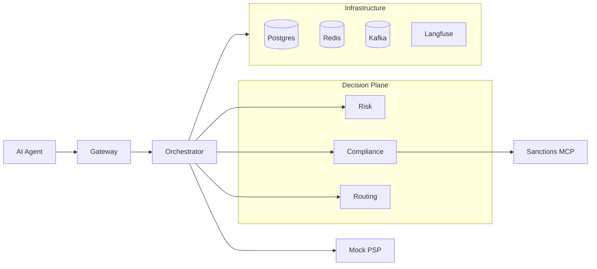

# AgentPay Gateway

When an AI agent initiates a payment on behalf of a human, three things break at once: there is no OAuth client to authenticate, no human-in-the-loop to approve risk, and no clean way to compensate if a downstream check fails after the funds are held. AgentPay Gateway is a reference architecture for that problem — a Java 21 / Spring Boot 3.5 payment gateway that authenticates agents via scoped JWT intent tokens, decides each case through a parallel multi-agent risk-and-compliance plane on Spring AI 1.1.5, and unwinds cleanly via an explicit Saga with a transactional outbox to Kafka.

[](https://github.com/deniskarlinsky/agentpay-gateway/actions/workflows/ci.yml) [](https://opensource.org/licenses/MIT)



`REQUIREMENTS.md` is the contract. `docs/architecture.md` is the rationale. This file is the
quick start.

## Quick start

**Prerequisites.** Docker Desktop, Java 21 LTS, an `ANTHROPIC_API_KEY` in `.env`.
Copy `.env.example` → `.env` and fill in `ANTHROPIC_API_KEY` (and `VOYAGE_API_KEY` if running the routing-RAG path). `.env` is gitignored — never commit real keys.

```bash
# 1. Bring up the full stack (Postgres, Kafka, Redis, ClickHouse, Langfuse,
#    Prometheus, Grafana, OTel collector, and the five services).
make up                           # ≤ 5 minutes from a clean checkout

# 2. Run the end-to-end demo. Issues an intent token, submits a payment,
#    polls for terminal state, prints the Langfuse trace URL.
make demo                         # Scenario A (happy) + Scenario B (compliance-fail)

# 3. Watch the dashboards.
open http://localhost:3001        # Grafana — AgentPay/AgentPay — Decision Plane
open http://localhost:3000        # Langfuse — parallel specialist spans
open http://localhost:9090        # Prometheus

# 4. Tests.
make test                         # all unit + integration tests
make eval                         # eval suite (Haiku-as-judge + deterministic)

# 5. Tear down.
make down
```

## Tech stack

| Layer | Choice | Why |
|---|---|---|
| Language | Java 21 LTS | Virtual threads stable since Sept 2023 — no preview flag. |
| Framework | Spring Boot 3.5.4 | Pinned; servlet stack, not reactive. |
| AI | Spring AI 1.1.5 | Pinned; `ChatClient` fluent API + native Micrometer observability. |
| Models | claude-sonnet-4-6 (reasoning), claude-haiku-4-5 (classification) | No Opus. See [ADR-007](docs/adr/007-model-routing.md). |
| Storage | Postgres 16 + pgvector | Saga state + outbox + agent_verdicts + routing-metrics RAG. |
| Messaging | Kafka 3.7 (KRaft, transactional producer) | Terminal events + outbox publisher. |
| Rate limit / replay | Redis 7 + Bucket4j | Per-agent 60 rpm + intent-token `jti` replay store. |
| Observability | OTLP → otel-collector → Langfuse + Prometheus + Grafana | Native chat-model spans from Spring AI 1.1.5. |
| MCP | spring-ai-starter-mcp-server-webmvc / -mcp-client | One sanctions MCP server, called by ComplianceAgent. |

**Stack policy (non-negotiable):** see `CLAUDE.md`. No preview Java features. No
`-M`/`-RC`/`-SNAPSHOT` deps. No Opus. No reactive Spring. No Spring State Machine.

See [docs/architecture.md](docs/architecture.md) for the full system walkthrough and [docs/adr/](docs/adr/) for design decisions.

## ADR index

| ADR | Subject |
|---|---|
| [001](docs/adr/001-stable-stack-baseline.md) | Pin to Java 21 + Spring Boot 3.5 + Spring AI 1.1.5 |
| [002](docs/adr/002-saga-coordinator-vs-state-machine.md) | Explicit Saga coordinator, not Spring State Machine |
| [003](docs/adr/003-workflow-vs-agent-for-payment-decisioning.md) | Multi-agent fan-out for payment decisioning |
| [004](docs/adr/004-a2a-discovery-only.md) | A2A discovery endpoint only — no JSON-RPC surface |
| [005](docs/adr/005-one-mcp-server.md) | One MCP server (sanctions lookup) |
| [006](docs/adr/006-virtual-threads-no-preview.md) | Virtual threads + CompletableFuture, no StructuredTaskScope |
| [007](docs/adr/007-model-routing.md) | Haiku for routing, Sonnet for risk + compliance, no Opus |
| [008](docs/adr/008-evals-as-ci-gate.md) | Eval regression fails CI |
| [009](docs/adr/009-pgvector-canonical-schema.md) | Spring AI canonical pgvector schema for `route_metrics` |
| [010](docs/adr/010-transactional-outbox-vs-chained-kafka-tx-manager.md) | Transactional outbox for atomic state + event |

## Where to read next

| If you want… | Read |
|---|---|
| The full contract with acceptance criteria | `REQUIREMENTS.md` |
| The big picture with Mermaid + C4 diagrams | [`docs/architecture.md`](docs/architecture.md) |
| The 9-state Saga and its compensation rule | [`docs/saga-states.md`](docs/saga-states.md) |
| The STRIDE threat model | [`docs/threat-model.md`](docs/threat-model.md) |
| What is not fully working at v0.1-mvp | [`docs/known-issues.md`](docs/known-issues.md) |
| Stack policy and gotchas for future contributors | `CLAUDE.md` |
| The iteration-by-iteration build journal | `CLAUDE_CODE_PLAYBOOK.md` |

## License

Licensed under the MIT License — see [LICENSE](LICENSE) for details.
