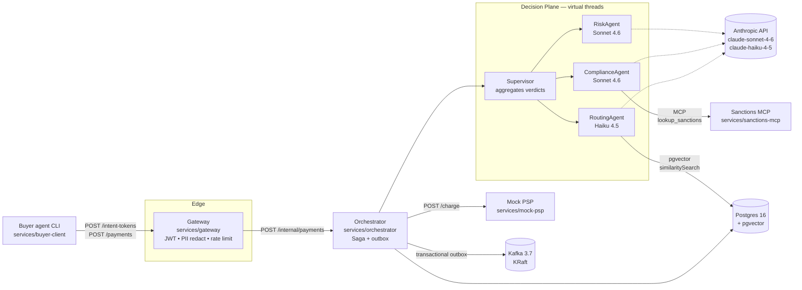
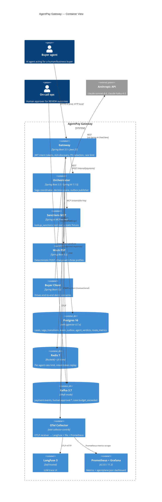

# Architecture — AgentPay Gateway

> Companion to the top-level `README.md`. Cross-references the ADRs under `docs/adr/`. Source of
> truth for code-level contracts is `REQUIREMENTS.md`.

## Mission, in one paragraph

AgentPay Gateway is an agent-native payment gateway pet/portfolio project. It demonstrates how a
payment platform can authenticate AI agents as clients, authorize transactions initiated on behalf
of humans or businesses, and run risk decisions through a multi-agent decision plane — while
preserving compensability (a Saga), observability (Langfuse + OpenTelemetry + Prometheus +
Grafana), and a hard cost ceiling. **The architecture is the artifact, not a production system.**

## Conceptual view

The Supervisor fan-out is the architectural focal point: three ChatClients, three records, one
deterministic aggregator. See [ADR-003](adr/003-workflow-vs-agent-for-payment-decisioning.md) for
why this shape was chosen despite costing ~15× the tokens of a single-agent design, and
[ADR-006](adr/006-virtual-threads-no-preview.md) for why virtual threads + `CompletableFuture`
replace `StructuredTaskScope`.

## C4 Container view

## Reading guide — what to look at, in order

1. **`REQUIREMENTS.md`** — the contract. Every `FR-*`/`NFR-*` ID below resolves there.
2. **`docs/saga-states.md`** — the 9-state Saga diagram and the compensation rule. Pair with
   [ADR-002](adr/002-saga-coordinator-vs-state-machine.md) and
   [ADR-010](adr/010-transactional-outbox-vs-chained-kafka-tx-manager.md).
3. **`services/orchestrator/src/main/java/com/agentpay/orchestrator/decision/Supervisor.java`** —
   the multi-agent fan-out core. ~50 lines of business logic. Pair with
   [ADR-003](adr/003-workflow-vs-agent-for-payment-decisioning.md) and
   [ADR-006](adr/006-virtual-threads-no-preview.md).
4. **`services/orchestrator/src/main/resources/prompts/{risk,compliance,routing}.md`** — the
   specialist system prompts. Note the **negative space** declaration at the top of each.
5. **`services/gateway/src/main/java/com/agentpay/gateway/web/IntentTokenController.java`** — JWT
   issuance and scope binding. Pair with `docs/threat-model.md`.
6. **`docs/adr/`** — ten ADRs documenting every load-bearing design decision.

## Cross-link: ADR index

| ADR | Subject |
|---|---|
| [001](adr/001-stable-stack-baseline.md) | Pin to Java 21 + Spring Boot 3.5 + Spring AI 1.1.5 |
| [002](adr/002-saga-coordinator-vs-state-machine.md) | Explicit Saga coordinator, not Spring State Machine |
| [003](adr/003-workflow-vs-agent-for-payment-decisioning.md) | Multi-agent fan-out for payment decisioning |
| [004](adr/004-a2a-discovery-only.md) | A2A discovery endpoint only — no JSON-RPC surface |
| [005](adr/005-one-mcp-server.md) | One MCP server (sanctions lookup) |
| [006](adr/006-virtual-threads-no-preview.md) | Virtual threads + CompletableFuture, no StructuredTaskScope |
| [007](adr/007-model-routing.md) | Haiku for routing, Sonnet for risk + compliance, no Opus |
| [008](adr/008-evals-as-ci-gate.md) | Eval regression fails CI |
| [009](adr/009-pgvector-canonical-schema.md) | Spring AI canonical pgvector schema for `route_metrics` |
| [010](adr/010-transactional-outbox-vs-chained-kafka-tx-manager.md) | Transactional outbox for atomic state + event |

## What is *not* in this picture

Out of scope per `REQUIREMENTS.md §4.2` and the ADRs above. The most architecturally significant
omissions:

- **No full A2A protocol.** Discovery endpoint only — see ADR-004.
- **No reactive Spring.** Servlet stack everywhere. The decision plane uses virtual threads on the
  servlet container — not WebFlux. ADR-001.
- **No Spring State Machine.** ADR-002.
- **No Opus.** Sonnet + Haiku only. ADR-007.
- **No real PSP, no real sanctions feed.** Mocks under `services/mock-psp/` and
  `services/sanctions-mcp/`.

Carry-over and known limitations: `docs/known-issues.md`.
