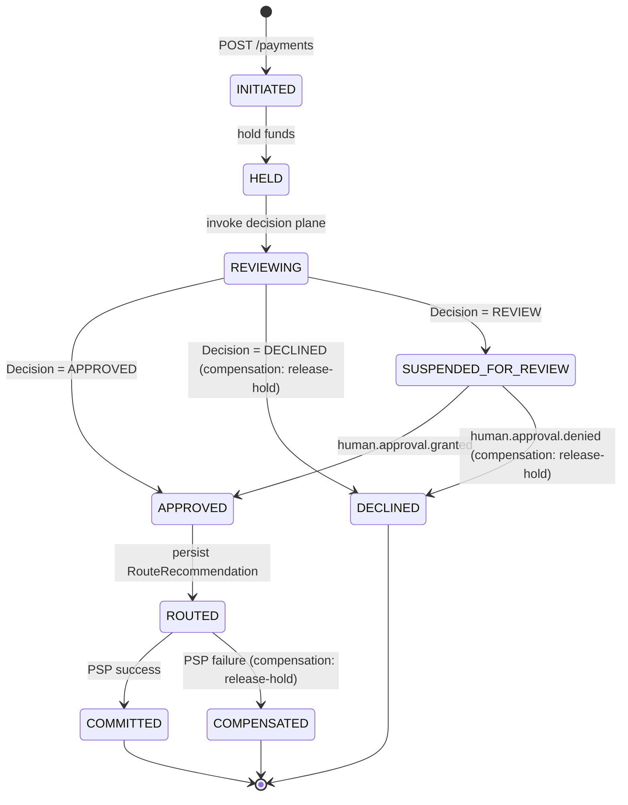

# Payment Saga — states and transitions

> Companion document to ADR-002 (`docs/adr/002-saga-coordinator-vs-state-machine.md`) and ADR-010
> (`docs/adr/010-transactional-outbox-vs-chained-kafka-tx-manager.md`). Canonical implementation:
> `services/orchestrator/src/main/java/com/agentpay/orchestrator/saga/PaymentSaga.java`.
> Enum source: `com.agentpay.orchestrator.domain.SagaState`.

## States (FR-O-001)

| State | Meaning | Terminal? |
|---|---|---|
| `INITIATED` | Case created, request validated | no |
| `HELD` | Funds reserved at PSP-side mock | no |
| `REVIEWING` | Decision plane is computing | no |
| `APPROVED` | Decision = APPROVED, route chosen | no |
| `ROUTED` | Routing recommendation persisted | no |
| `COMMITTED` | PSP confirmed charge | **yes** |
| `DECLINED` | Decision = DECLINED, hold released | **yes** |
| `COMPENSATED` | PSP failure after APPROVED, hold released | **yes** |
| `SUSPENDED_FOR_REVIEW` | Awaiting `human.approval.*` Kafka event | no (resumable) |

## State diagram

Terminal states are absorbing — once entered, no further transitions. `SUSPENDED_FOR_REVIEW` is a
recoverable pause: the Saga sits until a `human.approval.granted` or `human.approval.denied`
Kafka message arrives on `human.approval.responses`, after which it resumes from either the
APPROVED path or the DECLINED compensation path.

## Forward vs compensating transitions

| Transition | Kind | Compensation rule (FR-O-008) |
|---|---|---|
| `INITIATED → HELD` | forward | reverse step on failure: release-hold |
| `HELD → REVIEWING` | forward | no PSP-visible side effect; pure DB |
| `REVIEWING → APPROVED` | forward | persists `Decision` JSONB on `cases.decision_jsonb` |
| `REVIEWING → DECLINED` | **compensating** | release-hold; emits `payment.declined` |
| `REVIEWING → SUSPENDED_FOR_REVIEW` | forward (pause) | emits `human.approval.requested` via outbox |
| `SUSPENDED_FOR_REVIEW → APPROVED` | forward | resumes from the APPROVED path |
| `SUSPENDED_FOR_REVIEW → DECLINED` | **compensating** | release-hold; emits `payment.declined` |
| `APPROVED → ROUTED` | forward | route persisted; no PSP call yet |
| `ROUTED → COMMITTED` | forward | PSP success; emits `payment.completed` |
| `ROUTED → COMPENSATED` | **compensating** | PSP failure after APPROVED; release-hold; emits `payment.compensated` |

## Terminal Kafka events (FR-O-009)

Exactly one per Saga:

| Terminal state | Kafka event | Topic |
|---|---|---|
| `COMMITTED` | `payment.completed` | `payment.events` |
| `DECLINED` | `payment.declined` | `payment.events` |
| `COMPENSATED` | `payment.compensated` | `payment.events` |

Non-terminal lifecycle events (do not close the Saga):

| Trigger | Kafka event | Topic |
|---|---|---|
| Entering `SUSPENDED_FOR_REVIEW` | `human.approval.requested` | `human.approval.requests` |
| Per-case cost cap exceeded mid-flight | `case.budget_exceeded` | `case.budget_exceeded` |

Every event is written to `event_outbox` inside the same `@Transactional` boundary as the state
transition that produced it (NFR-R-003). The `OutboxPublisher` polls and ships them via a
transactional Kafka producer with at-least-once semantics — consumers are idempotent on `case_id`.
See ADR-010 for the full rationale.

## Idempotency (FR-O-007)

Key: `case_id`. The `cases` table has a unique primary-key constraint; an INSERT collision on a
retried POST returns the existing terminal state instead of starting a duplicate Saga. The Saga's
forward-driving loop reads the current state from the DB on each iteration, so a concurrent
request observing a partially-progressed case finishes the same work without re-issuing side
effects.

## Crash recovery (Scenario G / NFR-R-002)

On orchestrator startup, `SagaRecoveryRunner` scans `cases` for rows where `state` is not in
{`COMMITTED`, `DECLINED`, `COMPENSATED`} and resumes each via `PaymentSaga.driveForward(caseId)`.
Every step is idempotent against its mock side effect, so re-running the loop from the last
persisted state always converges on a terminal state within the per-case budget.
